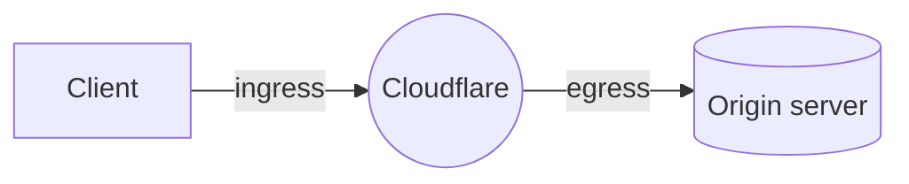

[Spectrum](/spectrum/) allows you to route email, file transfer, games, and more over TCP or UDP through Cloudflare. This means you can mask your origin and protect it from DDoS attacks.

While you can use [BYOIP](/byoip/) or static IPs to control which IPs are used for ingress with Spectrum, Aegis allows you to have a more strict list of [egress IPs](/aegis/about/) as well.

Aegis with Spectrum supports both TCP and UDP application types. HTTP/HTTPS types are also supported, although through a different configuration.

If you are interested in any of these solutions, contact your account team.