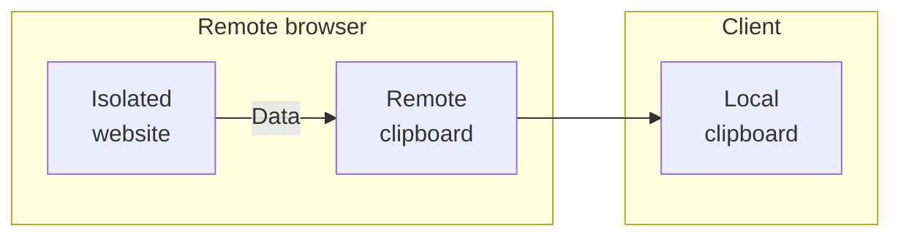
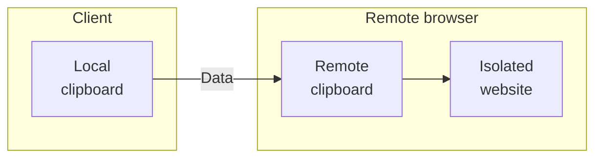

import { Render } from "~/components"

With Browser Isolation, you can define policies to dynamically isolate websites based on identity, security threats, or content.

## Isolate

When an HTTP policy applies the Isolate action, the user's web browser is transparently served an HTML compatible remote browser client. Isolation policies can be applied to requests that include `Accept: text/html*`. This allows Browser Isolation policies to co-exist with API traffic.

The following example enables isolation for all web traffic:

| Selector | Operator      | Value | Action  |
| -------- | ------------- | ----- | ------- |
| Host     | matches regex | `.*`  | Isolate |

If instead you need to isolate specific pages, you can list the domains for which you would like to isolate traffic:

| Selector | Operator | Value                        | Action  |
| -------- | -------- | ---------------------------- | ------- |
| Domain   | In       | `example.com`, `example.net` | Isolate |

:::note[Isolate identity providers for applications]

Existing cookies and sessions from non-isolated browsing are not sent to the remote browser. Websites that implement single sign-on using third-party cookies will also need to be isolated.

For example, if `example.com` authenticates using Google Workspace, you will also need to isolate the top level [Google Workspace URLs](https://support.google.com/a/answer/9012184).

:::

## Do Not Isolate

You can choose to disable isolation for certain destinations or categories. The following configuration disables isolation for traffic directed to `example.com`:

| Selector | Operator | Value         | Action         |
| -------- | -------- | ------------- | -------------- |
| Host     | In       | `example.com` | Do Not Isolate |

## Policy settings

The following optional settings appear in the Gateway HTTP policy builder when you select the _Isolate_ action. Configure these settings to [prevent data loss](https://blog.cloudflare.com/data-protection-browser/) when users interact with untrusted websites in the remote browser.

### Copy (from remote to client)

- _Allow_: (Default) Users can copy content from an isolated website to their local clipboard.
- _Allow only within isolated browser_: Users can only copy content from an isolated website to the remote clipboard. Users cannot copy content out of the remote browser to the local clipboard. You can use this setting alongside [**Paste (from client to remote)**: _Allow only within isolated browser_](/cloudflare-one/policies/browser-isolation/isolation-policies/#paste-from-client-to-remote) to only allow copy-pasting between isolated websites.
- _Do not allow_: Prohibits users from copying content from an isolated website.

### Paste (from client to remote)

- _Allow_: (Default) Users can paste content from their local clipboard to an isolated website.
- _Allow only within isolated browser_: Users can only paste content from the remote clipboard to an isolated website. Users cannot paste content from their local clipboard to the remote browser. You can use this setting alongside [**Copy (from remote to client)**: _Allow only within isolated browser_](/cloudflare-one/policies/browser-isolation/isolation-policies/#copy-from-remote-to-client) to only allow copy-pasting between isolated websites.
- _Do not allow_: Prohibits users from pasting content into an isolated website.

### File downloads

- _Allow_: (Default) User can download files from an isolated website to their local machine.
- _Do not allow_: Prohibits users from downloading files from an isolated website to their local machine.

:::note
This option does not prevent files from being downloaded into the remote browser. To prevent files being downloaded into the remote browser, use HTTP Policies to block by [Download Mime Type](/cloudflare-one/policies/gateway/http-policies/#download-and-upload-mime-type).
:::

### File uploads

- _Allow_: (Default) Users can upload files from their local machine into an isolated website.
- _Do not allow_: Prohibits users from uploading files from their local machine into an isolated website.

:::note
This option does not prevent files being uploaded to websites from third-party cloud file managers or files downloaded into the remote browser download bar from other isolated websites. To prevent files being uploaded from the remote browser into an isolated website, use HTTP Policies to block by [Upload Mime Type](/cloudflare-one/policies/gateway/http-policies/#download-and-upload-mime-type).
:::

### Keyboard

- _Allow_: (Default) Users can perform keyboard inputs into an isolated website.
- _Do not allow_: Prohibits users from performing keyboard inputs into an isolated website.

:::note
Mouse input remains available to allow users to browse a website by following hyperlinks and scrolling. This does not prevent user input into third-party virtual keyboards within an isolated website.
:::

### Printing

- _Allow_: (Default) Users can print isolated web pages to their local machine.
- _Do not allow_: Prohibits users from printing isolated web pages to their local machine.

## Common policies

### Isolate all security threats

Isolate security threats such as malware and phishing.

| Selector       | Operator | Value              | Action  |
| -------------- | -------- | ------------------ | ------- |
| Security Risks | in       | All security risks | Isolate |

### Isolate high risk content

Isolate high risk content categories such as newly registered domains.

| Selector           | Operator | Value          | Action  |
| ------------------ | -------- | -------------- | ------- |
| Content categories | in       | Security Risks | Isolate |

### Isolate news and media

Isolate news and media sites, which are targets for malvertising attacks.

| Selector           | Operator | Value          | Action  |
| ------------------ | -------- | -------------- | ------- |
| Content categories | in       | News and Media | Isolate |

### Isolate uncategorized content

Isolate content that has not been categorized by [Cloudflare Radar](/radar/).

| Selector           | Operator | Value                  | Action  |
| ------------------ | -------- | ---------------------- | ------- |
| Content categories | not in   | All content categories | Isolate |

### Isolate ChatGPT

Isolate the use of ChatGPT.

<Render file="gateway/policies/isolate-chatgpt" />
